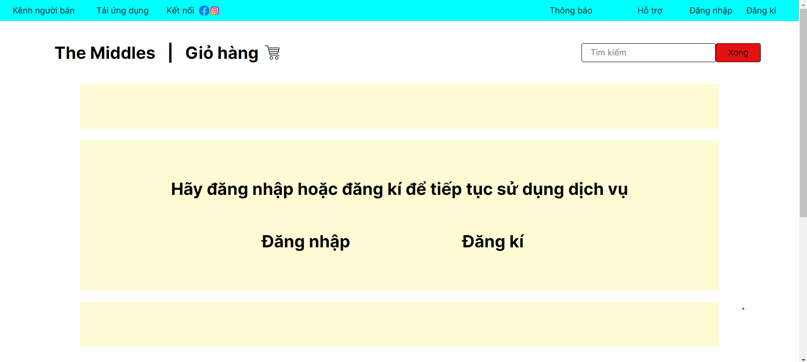
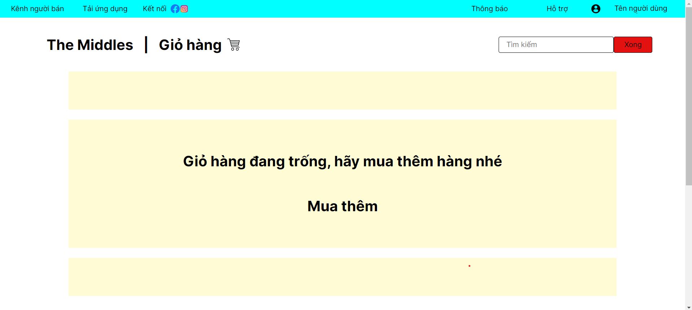

# Sản phẩm : Web thương mại điện tử The Middles

### Thành viên nhóm:
- 22022517 Bùi Tiến Sâm
- 22022521 Nguyễn Văn Mạnh
- 22022597 Trịnh Đắc Phú
- 22022654 Triệu Vũ Hoàn

### Công cụ sử dụng Django

### Trước khi làm việc
- Tải những thư viện cần thiết bằng `pip install -r requirements.txt`
- Học thêm về Django nếu chưa biết cách sử dụng [tại đây](https://www.w3schools.com/django/index.php).

## Cấu trúc sắp xếp file
```
The_Middle\
|---all_static_files\
|---global_static_files\
|---The_Middle\
    |---__init__.py
    |---asgi.py
    |---setting.py
    |---urls.py
    |---wsgi.py
|---manage.py
```
### Các trang web sẽ xuất hiện
http://127.0.0.1:8000/gio-hang-da-dang-nhap/

http://127.0.0.1:8000/gio-hang-chua-dang-nhap/

http://127.0.0.1:8000/gio-hang-trong/

http://127.0.0.1:8000/thanh-toan/
